# Social Media App
## 1. Introduction Product

Dự án web Django của chúng tôi là một nền tảng truyền thông xã hội đa chức năng, nơi người dùng có thể kết nối và tương tác thông qua nhắn tin, gọi video, và tạo nhóm. Nó cung cấp một không gian để chia sẻ suy nghĩ và ý tưởng thông qua việc đăng bài, kết bạn và bình luận các bài viết, tạo ra một cộng đồng sống động và tương tác. Dự án này không chỉ là một nền tảng giao tiếp mà còn là một môi trường để mọi người thể hiện bản thân và xây dựng mối quan hệ.

## 2. Installation Guide

# Linux

1.Cài đặt python : 
 ```bash
   sudo apt-get install python 
   ```

2.Cài đặt django : 
 ```bash
   pip install django 
   ```

3.Di chuyển vào thư mục dự án : 

 ```bash
   cd  social_media_app
   ```

4.Cài đặt các thư viện cần thiết từ file requirements.txt : 

```bash
   pip install -r requirements.txt
   ```
5.Chạỵ Cơ Sở Dữ Liệu: 
```bash
   python manage.py migrate
   ```

5.Chạy dự án web : 
```bash
   python manage.py runserver
   ```


# Windows
1.Cài đặt python
```bash
sudo apt-get install python 
```

1.Truy cập vào trang web của [python](https://www.python.org/downloads/) để lựa chọn phiên bản phù hợp
    
   2.Chạy file .exe để cài đặt
   
   3.Kiểm tra phiên bản : 
   ```bash
   python --version 
   ```
   
   
2.Cài đặt django : 
```bash
pip install django
```


3.Di chuyển vào thư mục dự án :
```bash
cd  social_media_app
```

4.Cài đặt các thư viện cần thiết từ file requirements.txt : 
```bash
cd  pip install -r requirements.txt
```

5.Chạy dự án web :
```bash
python manage.py runserver
```

### 3. Chức năng người dùng

#### 3.1 Đăng ký và đăng nhập

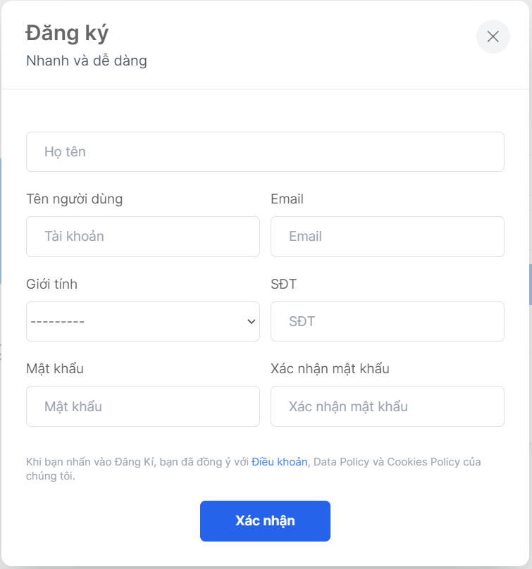
<h3 align="center">Đăng ký</h3>

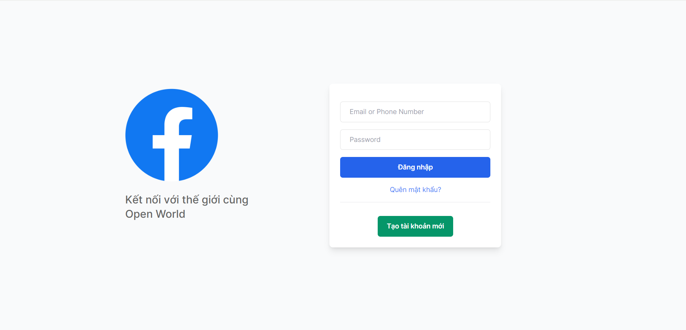
<h3 align="center">Đăng nhập</h3>

#### 3.2 Quản lý hồ sơ cá nhân

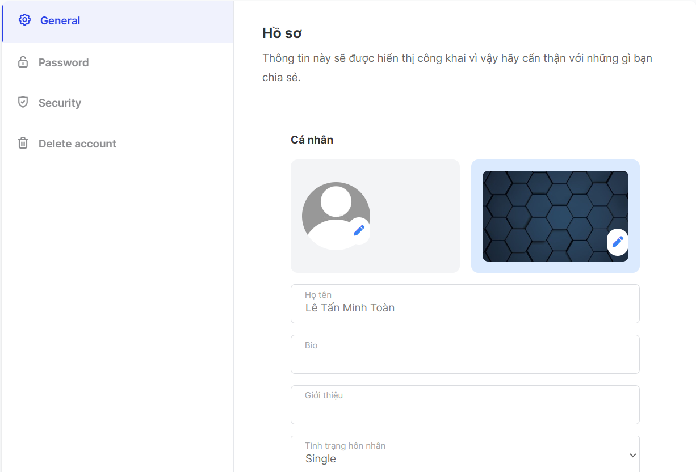
<h3 align="center">Hồ sơ cá nhân</h3>

#### 3.3 Gửi và nhận yêu cầu kết bạn

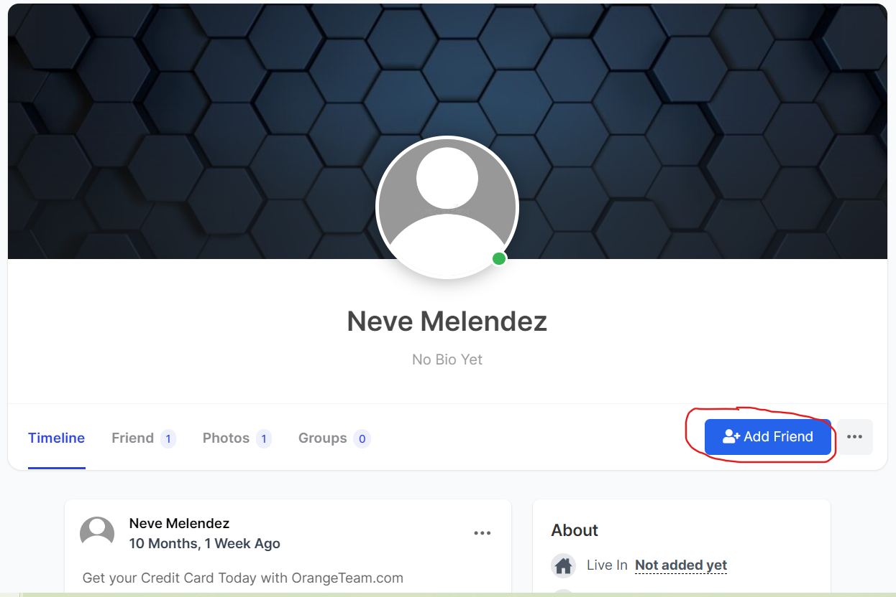
<h3 align="center">Gửi và nhận yêu cầu kết bạn</h3>

#### 3.4 Tìm kiếm người dùng

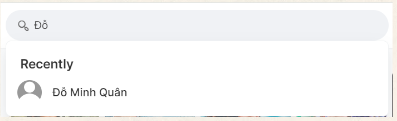
<h3 align="center">Tìm kiếm người dùng</h3>

### 5. Bài đăng và hoạt động mạng xã hội 
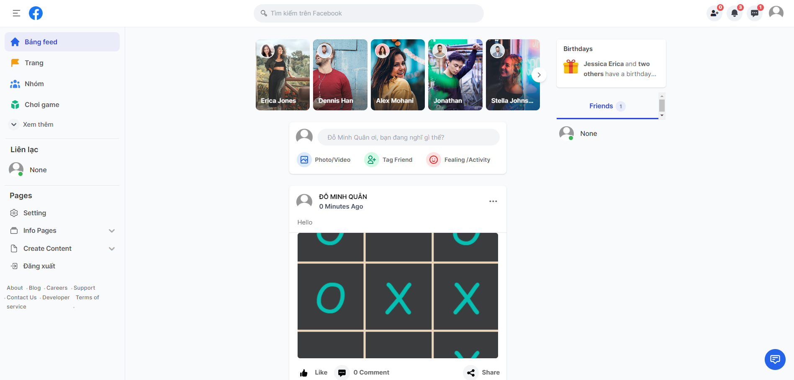
<h3 align="center">Post Page</h3>

#### 5.1 Like and comment bài đăng
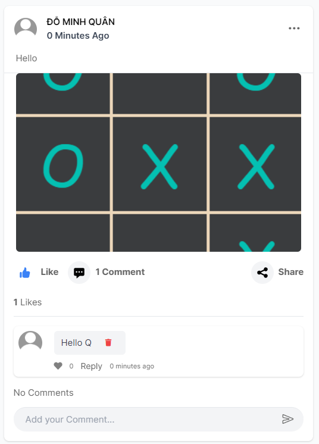
<h3 align="center">Like and comment bài đăng</h3>

#### 5.2 Tạo bài đăng
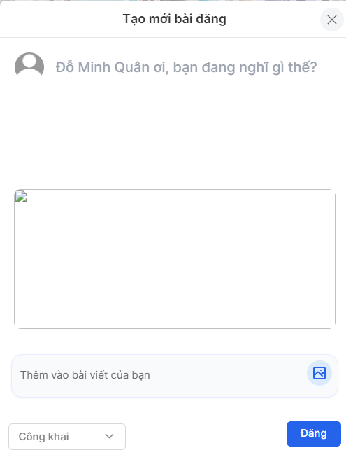
<h3 align="center">Tạo bài đăng</h3>

#### 5.3 Sửa bài đăng
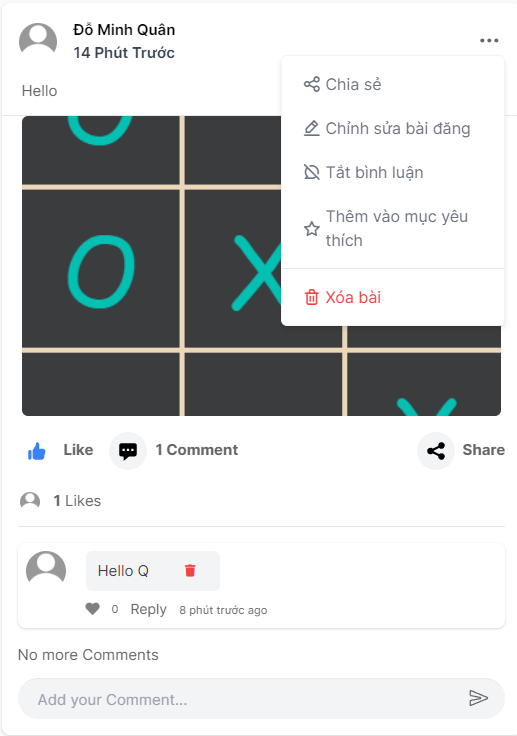
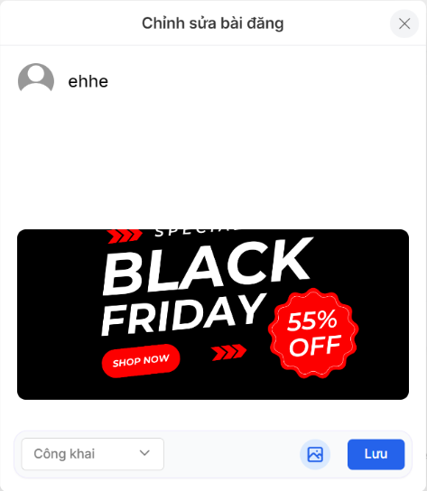
<h3 align="center">Sửa bài đăng</h3>

#### 5.3 Xóa bài đăng

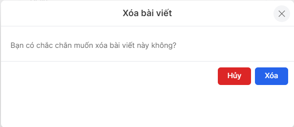
<h3 align="center">Xóa bài đăng</h3>

### 6. Game

<h3 align="center">Game Page</h3>

#### 6.1 Stack Brick


<h3 align="center">Stack Brick Page</h3>

#### 6.2 2048 Game


<h3 align="center">2048 Game Page</h3>

#### 6.3 Tic Tac Toe


<h3 align="center">Tic Tac Toe Page</h3>

#### 6.4 Fire && Water


<h3 align="center">Fire && Water Page</h3>

#### Any question you can contact with us


Author:

| leader                | member       | member         | member         |
|-----------------------|--------------|----------------|----------------|
|Lê Tấn Minh Toàn       | Lê Ngọc Giàu | Đỗ Minh Quân   | Tăng QUốc Tuấn |


#### Contact email:
- [letanminhtoan2505@gmail.com](mailto:letanminhtoan2505@gmail.com)
- [lengocgiau2k3@gmail.com](mailto:lengocgiau2k3@gmail.com)
- [dominhquan15623@gmail.com](mailto:dominhquan15623@gmail.com)
- [tangquoctuan2003@gmail.com](mailto:tangquoctuan2003@gmail.com)


#### Note:
The website won second prize at the University of Natural Sciences in the Hackathon Contest


[def]: ocial_media_app\asset\game
